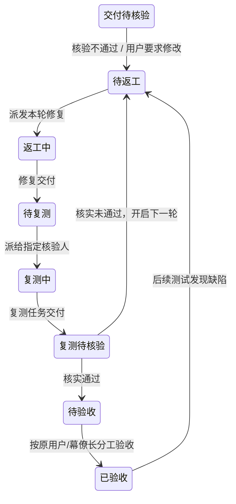

# 项目、工作包和执行的生命周期

2026-09-09 · DSH 原生执行路线 · 开发跟踪 ENV-de7f

## 问题与边界

旧实现将成员回复当作阶段完成，将写入 PROFILE.md 当作归档，后台协调的 pending 状态又只在内存里。这造成未验收就派发下游、归档后仍可能自动继续、工具报错后仍口头宣称完成。

现在将生命周期控制集中在 project-lifecycle.mjs。模型提出动作，服务校验状态、版本和前置条件并持久化，界面与调度读取同一记录。项目状态不是模型回复的解析结果。

DSH Agent/Session 继续负责模型与工具执行、取消和提供方重试；本层负责项目是否允许执行、工作包是否通过用户验收。未引入第二个模型执行引擎或 Beads 运行时账本。

## 三层状态

| 层 | 状态与职责 |
|---|---|
| 项目 | active / paused / blocked / completed / cancelled / archived；决定调度准入 |
| 工作包 | 待开始、等待前置验收、排队、执行、交付待验收、已验收；失败/取消是当前尝试的结果，允许在原授权范围内重新派发 |
| 执行尝试 | queued / claimed / replied / failed / cancelled；一次模型执行结束不代表工作包验收或项目完成 |

项目没有随单次模型错误变化的 failed 状态。网络请求失败由原生重试处理；预算耗尽后保留失败尝试与检查点。下一步可以修复、重新拆包或明确阻塞，不能自动宣告项目失败或完成。

## 项目状态转换

| 操作 | 来源 | 结果 | 规则 |
|---|---|---|---|
| pause | active / blocked | paused | 立即关闭新派工和唤醒；已接纳执行继续收尾，不冒充已停止进程 |
| block | active / paused | blocked | 必须记录原因、负责人、解除条件 |
| resume | paused / blocked | active | 必须由当前用户明确要求，并填写说明；不是自动解除阻塞 |
| complete | active / paused | completed | 所有登记工作包验收有效、没有排队或执行中工作 |
| cancel | active / paused / blocked | cancelled | 必须先无执行中操作；使旧排队批次失效，保留文件与记录 |
| archive | active / paused / blocked / completed / cancelled | archived | 必须先无执行中操作；保存计划、任务状态和检查点快照，关闭派工与唤醒，使旧批次失效 |
| restore | archived / completed / cancelled | paused | 先恢复为暂停，绝不立即运行；需要单独 resume |

取消项目和取消当前执行不同。需要立即停止当前执行时使用已有 DSH/插件停止入口，等待收尾再取消或归档项目。暂停后仍在执行是明确展示的排空过程，不是状态错误。

## 权威与接口

- lifecycle 文件是项目控制状态、验收记录、操作历史的唯一来源。
- team_project_lifecycle 只在幕僚长当前用户对话上下文中允许变更；后台任务和自动协调回合不能获得这个权限。
- 浏览器提供 POST /conversations/:id/lifecycle 与 POST /conversations/:id/accept-step；沿用宿主认证与同源边界。
- 每次变更要求 expectedRevision；旧版本得到冲突错误，调用者重新读取后再作决定，不能盲目覆盖。
- 工具成功时返回 ok:true 和持久状态回读；失败返回 ok:false。若本回合最后一次生命周期操作失败，响应层用服务失败结果替换模型可能生成的成功断言；提示规则也禁止把工具失败、写记忆或 checkpoint 当成归档。
- 验收只能通过用户界面/API 明确确认并提交依据。当前未开放给成员自验收工具。
- 归档索引保留 id 与名称作为恢复入口；归档项目详细内容不进入默认活跃项目简报。新项目使用独立项目群/会话；bot 身份记忆与已有文件继续保留，不自动迁移或删除工作目录。

## 工作包与依赖

有阶段计划时，派工须对应目标成员的一个工作包；同一成员对应多个步骤时需指定 step_id。前置包须全部有效验收，同包不允许重复排队/执行。成员完成后只能进入交付待验收。

验收绑定步骤标题、负责人、依赖和 jobIds 的指纹。改变范围、关联新尝试或修改前置包会令相关验收失效；依赖验收按图递归检查。验收依据保存在生命周期记录中，不等于系统自动跑过测试。

排队任务记录项目 epoch 和工作包范围指纹，执行准入在项目锁下再次检查状态、epoch、范围和依赖。仅关联刚派发 jobId 不改变任务的范围指纹；扩大标题范围、改负责人或依赖会阻止旧排队工作启动。

## 并发、持久化和失败

项目级短锁串行化派工、计划修改、验收和状态变更。执行租约只在进程内计数，阻止执行过程中归档或完成；运行主体不持有项目短锁。状态文件原子替换后才成功返回。文件损坏或写入失败不能降级为 active。

归档/取消增加 epoch，历史排队任务不再有效。暂停队列在扫描限额之前过滤，避免其他项目饿死。已持有 bot/workspace 排队位置的任务会复查项目状态并释放位置。

| 异常 | 处理 |
|---|---|
| 模型限流、网络错误 | 沿用 DSH 原生模型请求重试；不盲目重做整个项目 |
| 当前协调取消 | 保留未处理事实，不自动重试该协调 |
| 协调期间新交付 | 保留下一批通知；窗口已过也不重复启动在途协调 |
| 等待执行锁时状态改变 | 原生 idle 后重新构建输入；项目停止时不启动模型 |
| 状态并发修改 | revision 冲突，拒绝旧写入 |
| 队列晚到、旧尝试 | epoch/范围不匹配，不执行 |
| 验收后范围变化 | 验收指纹和依赖失效，重新验收 |
| 插件卸载 | 关闭新事件，清理唤醒 timer 与探针 |
| 外部操作超时但结果不明 | 先核对实际结果；本层不承诺外部副作用恰好一次 |

## 迁移与运行边界

缺少生命周期记录的旧项目采用 active、revision=0、epoch=0 的兼容视图，不修改既有文件。旧 replied 阶段一律视为待验收，不能推断为已验收。不会根据长期记忆中的“已归档”文字批量迁移状态；必须按用户实际指令，显式执行归档并回读。

本机旧鸿蒙传输项目已于 2026-09-09 部署后按用户原指令正式归档，状态回读 archived/revision=1/epoch=1，757 个成果文件哈希保持不变。后续升级仍须区分候选测试和实际运行验证。

持久生命周期不等于完整持久邮箱：协调通知本身跨崩溃的确认水位、跨进程租约、Native Goal 的真实用户来源映射仍由 ENV-mrqh 跟踪。本版是单进程插件；不支持两个 harness 同时写同一项目目录。原生 Goal/Team 不作未经验证的替换，也不承诺每轮独立自动验收。

## 验收

模块测试覆盖状态图、版本竞争、暂停排空、归档恢复、损坏拒绝、依赖与验收指纹、扫描公平性。实际插件路由测试覆盖归档回读、冻结项目拒绝模型/派工、回合外控制工具拒绝、恢复先暂停；React 组件测试覆盖归档状态、验收与执行结果分离，以及看板不再暴露管理表单。

发布前还需构建候选并完成全部既有测试；安装后验证用户实际归档状态与界面。测试记录与部署进度存放 Beads，文档不作为任务清单。

## 对话管理与用户交接

用户通过幕僚长对话管理项目。任务看板只显示计划、状态、检查点与历史，不暴露归档下拉框、原因输入框或验收按钮。实际权限审批继续使用原有审批机制，不用项目验收替代工具授权。

- 创建项目时持久化 `originConversationId`，自动协调仍保留项目群记录。
- 用户验收阶段交付并由幕僚长汇报后，生成持久审阅请求，包含项目、阶段、计划/任务指纹、执行 epoch、摘要、可打开的成果快照（最多 5 个、每个不超过 2 MiB）及明确决定方式。未能生成快照的文件保留路径，不能声称已有快照。
- 请求写入来源会话后才标记 delivered。delivered 表示已写入会话，不表示用户已读。投递失败退避重试，稳定 messageId 防止重启后重复写入。旧项目没有来源记录时回幕僚长私聊；只补送时间晚于成员交付的幕僚长汇报，成员自报不会直接触发审阅。
- 用户在对话明确通过后，幕僚长用 `team_accept_step` 代办。必须提供已送达 requestId 和当前 revision；校验阶段指纹、epoch 及已生成快照对应的源文件哈希。审阅期间成果变化时拒绝旧决定，重新交付后再审阅。审计保留用户本轮原话。
- 工程阶段可在用户对话规划时指定 `reviewMode=chief`，由 `team_review_step` 在实际检查后记录审核；设计方向及最终交付为 user。省略模式保留原值，旧计划默认 user；后台不能把 user 降为 chief，计划叶节点不能使用 chief。
- 陈旧、已验收或已归档请求在投递前失效，不重新唤醒模型。审阅 outbox 与原有协调消息邮箱不同；完整协调崩溃恢复及跨进程租约仍由 ENV-mrqh 跟踪。

模型负责理解自然语言中的用户意图与证据质量；运行时负责会话权限、请求送达、状态版本、阶段分工及依赖约束。测试不代表模型在所有措辞下都能正确判断用户意图。

## 退回、返工与复测

项目生命周期与阶段返工轮次分开存储。项目可以保持 active，只有缺陷阶段及其传递依赖受影响；其他分支继续。返工不会通过硬超时截断已有执行，也不代表整个项目失败。

`team_return_step` 必须包含缺陷、证据、复测标准、核验人、阶段指纹和项目 revision。普通缺陷可由幕僚长处理，需求范围变更必须来自当前用户对话。原验收、旧轮次及受影响阶段写入历史，状态在同一次原子写入中更新。并发退回只有一个能通过版本校验。

每个受影响阶段增加 generation，撤销其验收；已运行的旧任务允许收尾，旧队列在启动前拒绝，晚到结果只保留历史。下游即使曾经完成，在上游修复后也不能自动恢复原验收，必须基于新版本重新核验。现有依赖图决定影响范围；跨模块隐含依赖仍需要幕僚长在计划中明确登记。

修复和复测通过 `team_send_task` 的 `work_kind=repair/retest` 关联原 step_id。队列持久记录 generation、角色与阶段范围；关联不依赖模型再次写 jobIds，因此交付和复测可由不同成员完成而不更改原计划负责人。本轮修复尚未交付时不能启动复测，复测交付后须用 `team_record_retest` 核实结果；成员自报、旧轮次报告不能替代这一步。

复测失败自动开启新轮次并保留失败证据；执行本身失败可以接续当前修复或复测角色，不误判为产品缺陷已修复。连续三轮需要幕僚长重新分析原因和方案，不设置硬超时或自动验收。调整方案或人员使用显式 `action=revise`，保留旧轮次、记录原因、开启新轮次。未闭环阶段不能通过删步骤或改标题绕过返工。

复测通过仅进入原验收规则。用户阶段会持久发送新成果审阅请求，包含新的 generation 指纹；旧请求不能通过新轮次。归档、取消或完成项目不能自动开始返工，必须由用户先明确恢复。

动态计划增加 planRevision、历史快照及步骤 scopeVersion。幕僚长保存时必须提供 expectedPlanRevision；历史 jobIds 不得删除。非任务关联的阶段范围变化提升 scopeVersion，即使后来恢复旧标题，也不能复活旧验收。验收还保存直接依赖版本，阻止新上游配旧下游验收。

测试覆盖分支失效、并发退回、复测前禁止验收、复测失败下一轮、旧结果隔离、修复/核验人员分离与变更、动态计划版本冲突、真实插件工具派发闭环、看板只展示返工状态。本层校验记录关联和状态时序，测试结论本身仍须幕僚长检查真实产物与报告。
